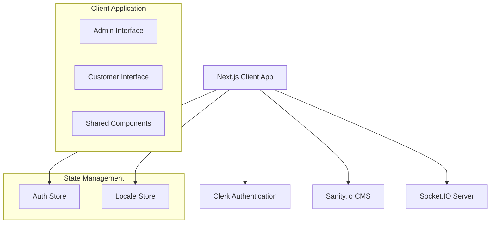

# Design Document

## Overview

The Electrician Shop Management System is a full-stack Next.js application with TypeScript that provides role-based interfaces for administrators and customers. The system leverages modern web technologies including Clerk for authentication, Sanity.io for content management, Socket.IO for real-time communication, and Zustand for state management. The application features a responsive dark-mode interface built with TailwindCSS and shadcn/ui components.

## Architecture

### High-Level Architecture



### Technology Stack

- **Frontend Framework**: Next.js 15.4.5 with React 19.1.0 and TypeScript
- **Styling**: TailwindCSS 4.0 with shadcn/ui components
- **Authentication**: Clerk (admin-controlled user creation)
- **Backend/CMS**: Sanity.io for data storage and management
- **Real-time Communication**: Socket.IO for live updates
- **State Management**: Zustand for client-side state
- **Icons**: Lucide React icons
- **Animations**: Framer Motion for smooth transitions
- **UI Components**: shadcn/ui component library

### Folder Structure

```
/src
  /app
    /login
      page.tsx
    /admin
      /dashboard
        page.tsx
      /customers
        page.tsx
        /[id]
          page.tsx
      /billing
        page.tsx
      /sales-report
        page.tsx
      /settings
        page.tsx
    /customer
      /home
        page.tsx
      /book
        page.tsx
      /profile
        page.tsx
    layout.tsx
    page.tsx
  /components
    /ui
      button.tsx
      card.tsx
      input.tsx
      modal.tsx
      table.tsx
      toast.tsx
    /forms
      login-form.tsx
      customer-form.tsx
      billing-form.tsx
    /modals
      customer-modal.tsx
      billing-modal.tsx
      confirmation-modal.tsx
  /lib
    clerk.ts
    sanity.ts
    socket.ts
    utils.ts
  /store
    auth-store.ts
    locale-store.ts
  /types
    index.ts
  /utils
    roles.ts
    format.ts
    billing.ts
    notifications.ts
```

## Components and Interfaces

### Authentication System

**Clerk Integration**

- Admin-only user creation workflow
- Customer login with ID and secret key
- Role-based access control
- Session management and token handling

**Auth Store (Zustand)**

```typescript
interface AuthState {
  user: User | null;
  role: "admin" | "customer" | null;
  isAuthenticated: boolean;
  login: (credentials: LoginCredentials) => Promise<void>;
  logout: () => void;
  updateProfile: (data: ProfileData) => Promise<void>;
}
```

### User Interface Components

**Core UI Components (shadcn/ui)**

- `Button`: Primary, secondary, destructive variants with loading states
- `Card`: Container component with header, content, and footer sections
- `Input`: Form inputs with validation states and error messages
- `Modal`: Animated modal dialogs with backdrop and close functionality
- `Table`: Data tables with sorting, filtering, and pagination
- `Toast`: Notification system for success, error, and info messages
- `Badge`: Status indicators and labels
- `Avatar`: User profile images with fallback initials
- `Form`: Form wrapper with validation and error handling
- `Dropdown`: Menu components for actions and selections

**Custom Components**

- `LoginForm`: Customer authentication with ID/key inputs
- `CustomerForm`: Admin form for creating/editing customers
- `BillingForm`: Invoice creation with item selection and calculations
- `SalesChart`: Visual representation of sales data and trends
- `NotificationToast`: Real-time notification display
- `LoadingSpinner`: Loading states for async operations

### Page Components

**Admin Pages**

- `AdminDashboard`: Overview with key metrics and quick actions
- `CustomerManagement`: CRUD operations for customer accounts
- `CustomerDetail`: Individual customer view with billing history
- `BillingPage`: Invoice creation and management interface
- `SalesReport`: Analytics dashboard with charts and export options
- `AdminSettings`: Profile management and system configuration

**Customer Pages**

- `CustomerHome`: Welcome dashboard with recent activity
- `BillingBook`: Personal invoice history and details
- `CustomerProfile`: Account settings and password management

**Shared Pages**

- `LoginPage`: Authentication interface for all users
- `NotFoundPage`: 404 error page with navigation options

## Data Models

### Sanity.io Schema

**Customer Document**

```typescript
{
  _type: 'customer',
  _id: string,
  clerkId: string,
  name: string,
  phone: string,
  location: string,
  createdAt: datetime,
  updatedAt: datetime,
  isActive: boolean
}
```

**Item Document**

```typescript
{
  _type: 'item',
  _id: string,
  name: string,
  price: number,
  category: 'wiring' | 'fan' | 'switch' | 'custom',
  description?: string,
  isActive: boolean,
  createdAt: datetime,
  updatedAt: datetime
}
```

**Bill Document**

```typescript
{
  _type: 'bill',
  _id: string,
  customer: reference,
  itemsUsed: [{
    item: reference,
    quantity: number,
    unitPrice: number,
    totalPrice: number
  }],
  serviceType: 'repair' | 'sale' | 'custom',
  locationType: 'shop' | 'home',
  homeVisitFee?: number,
  subtotal: number,
  totalAmount: number,
  notes?: string,
  createdAt: datetime,
  createdBy: string
}
```

### TypeScript Interfaces

**Frontend Types**

```typescript
interface User {
  id: string;
  clerkId: string;
  name: string;
  phone: string;
  location: string;
  role: "admin" | "customer";
}

interface BillItem {
  id: string;
  name: string;
  quantity: number;
  unitPrice: number;
  totalPrice: number;
}

interface Bill {
  id: string;
  customerId: string;
  customerName: string;
  items: BillItem[];
  serviceType: ServiceType;
  locationType: LocationType;
  homeVisitFee: number;
  subtotal: number;
  totalAmount: number;
  createdAt: Date;
  notes?: string;
}

interface SalesReport {
  totalSales: number;
  totalProfit: number;
  totalLoss: number;
  billCount: number;
  topCustomers: Customer[];
  topItems: Item[];
  salesByMonth: MonthlyData[];
}
```

## Error Handling

### Client-Side Error Handling

**Authentication Errors**

- Invalid credentials: Display user-friendly error message
- Session expiration: Redirect to login with notification
- Network errors: Retry mechanism with exponential backoff
- Role access violations: Redirect to appropriate dashboard

**Form Validation**

- Real-time field validation with error messages
- Form submission error handling with specific feedback
- Network timeout handling with retry options
- Data consistency validation before submission

**API Error Handling**

- HTTP status code handling (400, 401, 403, 404, 500)
- Network connectivity issues with offline detection
- Rate limiting with user feedback and retry delays
- Data synchronization errors with conflict resolution

### Server-Side Error Handling

**Sanity.io Integration**

- Connection failure handling with fallback mechanisms
- Data validation errors with detailed error messages
- Query timeout handling with appropriate user feedback
- Schema validation errors with developer-friendly logging

**Socket.IO Error Handling**

- Connection drops with automatic reconnection
- Message delivery failures with retry logic
- Room management errors with graceful degradation
- Real-time sync failures with manual refresh options

## Testing Strategy

### Unit Testing

**Component Testing**

- React component rendering and prop handling
- User interaction testing with React Testing Library
- Form validation and submission logic
- State management testing with Zustand stores
- Utility function testing with edge cases

**Integration Testing**

- API integration with Sanity.io and Clerk
- Socket.IO connection and message handling
- Authentication flow testing across components
- Role-based access control validation
- Real-time notification delivery testing

### End-to-End Testing

**User Journey Testing**

- Admin customer creation and management workflow
- Customer login and billing book access
- Bill creation and real-time notification delivery
- Sales report generation and data accuracy
- Profile management and password updates

**Cross-Browser Testing**

- Modern browser compatibility (Chrome, Firefox, Safari, Edge)
- Mobile responsiveness across different screen sizes
- Dark mode consistency across all browsers
- Animation performance and accessibility compliance

### Performance Testing

**Load Testing**

- Concurrent user handling and session management
- Database query performance with large datasets
- Real-time notification scalability
- Image and asset loading optimization

**Accessibility Testing**

- Keyboard navigation support
- Screen reader compatibility
- Color contrast compliance (WCAG 2.1 AA)
- Focus management and ARIA labels

### Security Testing

**Authentication Security**

- Session management and token validation
- Role-based access control enforcement
- Input sanitization and XSS prevention
- CSRF protection and secure headers

**Data Security**

- API endpoint security and rate limiting
- Data encryption in transit and at rest
- User input validation and SQL injection prevention
- Sensitive data handling and PII protection
