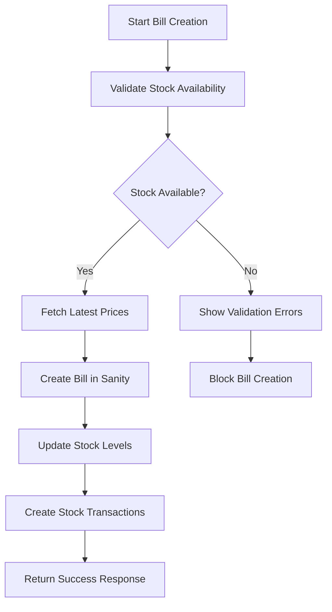

# Enhanced Inventory Management System

## 🎯 Overview

This document outlines the comprehensive inventory management system that addresses your requirements for real-time stock tracking, price management, and bill creation with automatic stock reduction.

## ✅ Key Features Implemented

### 1. **Real-time Stock Validation**
- ✅ Validates stock availability before bill creation
- ✅ Prevents negative stock scenarios
- ✅ Shows detailed validation results with product-wise breakdown
- ✅ Handles multiple items in a single bill

### 2. **Latest Price Fetching**
- ✅ Automatically fetches latest purchase and selling prices
- ✅ Uses most recent price if not provided in bill
- ✅ Shows price history and profit margins
- ✅ Handles price updates with timestamps

### 3. **Automatic Stock Reduction**
- ✅ Reduces stock automatically when bill is created
- ✅ Creates stock transaction records for audit trail
- ✅ Supports stock restoration (for returns/cancellations)
- ✅ Atomic operations to prevent data inconsistency

### 4. **Consolidated Inventory View**
- ✅ Groups same items from same brand with different prices
- ✅ Shows total quantity with latest prices
- ✅ Displays consolidation indicators
- ✅ Toggle between consolidated and detailed views

### 5. **Stock History & Tracking**
- ✅ Complete transaction history for each product
- ✅ Tracks all stock movements (purchase, sale, adjustment, return, damage)
- ✅ Links transactions to bills and suppliers
- ✅ Provides audit trail for inventory changes

## 🏗️ System Architecture

### Core Components

#### 1. **Inventory Management Core** (`src/lib/inventory-management.ts`)
```typescript
// Key functions:
- validateStockAvailability()  // Validates stock before operations
- fetchLatestPrices()         // Gets current pricing
- updateStockForBill()        // Handles stock updates
- getStockHistory()           // Retrieves transaction history
- getLowStockAlerts()         // Monitors stock levels
- calculateInventoryValue()   // Computes total inventory worth
```

#### 2. **Enhanced API Service** (`src/lib/inventory-api-enhanced.ts`)
```typescript
// Provides comprehensive API functions:
- validateBillStock()         // Pre-bill validation
- getLatestPrices()          // Price fetching
- processBillStockUpdate()   // Stock operations
- getLowStockAlerts()        // Alert system
- getInventoryValue()        // Value calculations
- bulkUpdateStock()          // Batch operations
```

#### 3. **React Hooks** (`src/hooks/use-enhanced-inventory.ts`)
```typescript
// React integration:
- useEnhancedInventory()     // Main inventory hook
- useStockValidation()       // Form validation hook
```

#### 4. **UI Components**
- **Stock Validation Display**: Shows validation results
- **Inventory Dashboard**: Comprehensive overview
- **Product Stock Status**: Real-time stock indicators

## 🔄 Bill Creation Workflow

### Enhanced Process Flow:



### Step-by-Step Implementation:

1. **Stock Validation** (Before bill creation)
   ```typescript
   const validation = await validateStockAvailability(billItems);
   if (!validation.isValid) {
     return { success: false, errors: validation.errors };
   }
   ```

2. **Price Fetching** (Get latest prices)
   ```typescript
   const latestPrices = await fetchLatestPrices(productIds);
   // Use latest prices if not provided in bill
   ```

3. **Bill Creation** (Create bill with validated data)
   ```typescript
   const bill = await sanityClient.create(newBill);
   ```

4. **Stock Update** (Reduce stock atomically)
   ```typescript
   const stockUpdate = await updateStockForBill(items, billId, 'reduce');
   ```

5. **Transaction Recording** (Create audit trail)
   ```typescript
   // Automatically creates stock transaction records
   // Links to bill for complete traceability
   ```

## 📊 Data Structures

### Stock Transaction Schema
```typescript
{
  _type: 'stockTransaction',
  transactionId: string,
  type: 'purchase' | 'sale' | 'adjustment' | 'return' | 'damage',
  product: Reference,
  quantity: number,
  unitPrice: number,
  totalAmount: number,
  bill?: Reference,
  supplier?: Reference,
  notes: string,
  status: 'completed' | 'pending' | 'cancelled',
  transactionDate: datetime,
  createdAt: datetime
}
```

### Enhanced Product Schema
```typescript
{
  // ... existing fields
  inventory: {
    currentStock: number,
    minimumStock: number,
    maximumStock?: number,
    reorderLevel: number,
    location?: string,
    lastStockUpdate?: datetime  // NEW: Track last update
  },
  _consolidated?: {  // NEW: For consolidated view
    totalEntries: number,
    originalIds: string[],
    latestPriceUpdate: string
  }
}
```

## 🚨 Stock Alert System

### Alert Levels:
1. **Out of Stock** (currentStock <= 0)
   - Critical priority
   - Blocks new sales
   - Immediate action required

2. **Low Stock** (currentStock <= minimumStock)
   - Warning priority
   - Allows sales but shows warning
   - Reorder recommended

3. **Reorder Level** (currentStock <= reorderLevel)
   - Info priority
   - Planning alert
   - Consider restocking

### Alert Implementation:
```typescript
const alerts = await getLowStockAlerts();
// Returns categorized alerts with action recommendations
```

## 💰 Price Management

### Latest Price Logic:
1. **Bill Creation**: Uses provided price OR fetches latest
2. **Price History**: Tracks all price changes with timestamps
3. **Profit Calculation**: Automatic margin calculation
4. **Price Validation**: Ensures prices are current

### Price Fetching:
```typescript
const priceMap = await fetchLatestPrices(productIds);
// Returns Map<productId, PriceInfo> with latest prices
```

## 📈 Inventory Analytics

### Value Calculation:
```typescript
const inventoryValue = await calculateInventoryValue();
// Returns:
// - totalValue: Total inventory worth
// - totalItems: Total item count
// - breakdown: Product-wise value breakdown
```

### Stock Movement Tracking:
- Daily/Weekly/Monthly summaries
- Top moving products
- Stock turnover rates
- Purchase vs. sales analysis

## 🔧 Usage Examples

### 1. Creating a Bill with Stock Validation
```typescript
import { createBill } from '@/lib/form-service';

const billData = {
  customerId: 'customer_123',
  items: [
    {
      productId: 'product_456',
      productName: 'LED Bulb 9W',
      quantity: 5,
      // unitPrice will be fetched automatically if not provided
    }
  ],
  serviceType: 'sale',
  locationType: 'shop'
};

const result = await createBill(billData);
// Automatically validates stock, fetches prices, and updates inventory
```

### 2. Using the Enhanced Inventory Hook
```typescript
import { useEnhancedInventory } from '@/hooks/use-enhanced-inventory';

function BillForm() {
  const { validateStock, fetchPrices, lowStockAlerts } = useEnhancedInventory();
  
  const handleValidation = async (items) => {
    const validation = await validateStock(items);
    if (!validation.isValid) {
      // Show validation errors
      setErrors(validation.errors);
    }
  };
}
```

### 3. Displaying Stock Validation Results
```typescript
import { StockValidationDisplay } from '@/components/inventory/stock-validation-display';

<StockValidationDisplay
  validationResults={validationResults}
  isValidating={isValidating}
  errors={errors}
/>
```

## 🛡️ Error Handling & Recovery

### Stock Validation Failures:
- Clear error messages
- Product-wise breakdown
- Suggested actions
- Prevention of invalid operations

### Stock Update Failures:
- Rollback mechanisms
- Manual intervention alerts
- Audit trail maintenance
- Data consistency checks

### Price Fetching Issues:
- Fallback to last known prices
- Manual price entry option
- Price validation warnings
- Historical price access

## 🔄 Migration & Deployment

### Database Updates:
1. Add `lastStockUpdate` field to inventory schema
2. Create `stockTransaction` document type
3. Update existing products with transaction history
4. Set up indexes for performance

### Code Deployment:
1. Deploy new inventory management functions
2. Update bill creation process
3. Add new UI components
4. Test stock validation workflow

## 📋 Testing Checklist

### Stock Validation:
- [ ] Validates single item availability
- [ ] Validates multiple items in one bill
- [ ] Prevents negative stock scenarios
- [ ] Shows clear validation messages
- [ ] Handles product not found cases

### Price Management:
- [ ] Fetches latest prices correctly
- [ ] Falls back to provided prices
- [ ] Handles missing price data
- [ ] Updates price history

### Stock Updates:
- [ ] Reduces stock on bill creation
- [ ] Creates transaction records
- [ ] Handles update failures gracefully
- [ ] Supports stock restoration

### UI Components:
- [ ] Stock validation display works
- [ ] Inventory dashboard shows correct data
- [ ] Consolidated view functions properly
- [ ] Alert system displays warnings

## 🚀 Future Enhancements

### Planned Features:
1. **Automated Reordering**: Auto-generate purchase orders
2. **Supplier Integration**: Direct supplier communication
3. **Barcode Scanning**: Quick stock updates
4. **Mobile App**: Field inventory management
5. **Advanced Analytics**: Predictive stock analysis
6. **Multi-location**: Support for multiple warehouses

### Performance Optimizations:
1. **Caching**: Redis for frequently accessed data
2. **Batch Operations**: Bulk stock updates
3. **Background Jobs**: Async stock calculations
4. **Database Indexing**: Optimized queries

## 📞 Support & Maintenance

### Monitoring:
- Stock level alerts
- System performance metrics
- Error rate tracking
- User activity logs

### Maintenance Tasks:
- Regular data cleanup
- Performance optimization
- Security updates
- Feature enhancements

---

## 🎉 Summary

This enhanced inventory management system provides:

✅ **Real-time stock validation** before bill creation  
✅ **Automatic stock reduction** with audit trails  
✅ **Latest price fetching** with fallback mechanisms  
✅ **Consolidated inventory view** for better management  
✅ **Comprehensive alerting** for stock issues  
✅ **Complete transaction history** for auditing  
✅ **User-friendly interfaces** for easy management  

The system ensures data consistency, prevents stock issues, and provides comprehensive inventory tracking while maintaining excellent user experience.